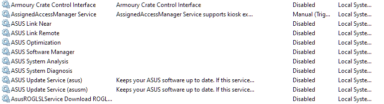

# G15Manager: An open source replacement to manage your Asus Zephyrus G15

  [](https://godoc.org/github.com/NeilSeligmann/G15Manager)

## Disclaimer

Work in progress. This may void your warranty. Proceed at your own risk.
Project forked from: [G14Manager](https://github.com/zllovesuki/G14Manager)

## Current Status
The project is currently under development.
Most of the current features come from the original [G14Manager](https://github.com/zllovesuki/G14Manager)

For a more advanced configuration, you will [need a client](https://github.com/NeilSeligmann/G15Manager-client).

Current Features:
1. Toggle microphone mute/unmute
2. Toggle touchpad
3. Keyboard brightness adjustment
4. Thermal profile switching
5. Fan curve control
6. On-screen display
7. Web Socket API
8. De-Noising AI (Armoury Crate files are required)

_Note_: Currently, the default profiles expect Power Plans "High Performance" and "Balanced" to be available. If your installation of Windows does not have those Power Plans, G15Manager will refuse to start. This will be fixed when customizable config is released.

## Bug Report

If your encounter an issue with using G15Manager (e.g. does not start, functionalities not working, etc), please download the debug build `G15Manager.debug.exe`, and run the binary in a Terminal with Administrator Privileges, then submit an issue with the full logs.

## Requirements

You must have a Zephyrus G15, and has Asus Optimization the driver (aka `atkwmiacpi64`) installed. You may check and see if `C:\Windows\System32\DriverStore\FileRepository\asussci2.inf_amd64_xxxxxxxxxxxxxxxx` exists.

G15Manager will most probably not work on other Zephyrus variants. If you have a G14 use [this manager instead](https://github.com/zllovesuki/G15Manager).

Tested G15 Models:
- G503QR

Asus Optimization (the service) **cannot** be running, otherwise G15Manager and Asus Optimization will be fighting over control. We only need Asus Optimization (the driver) to be installed so Windows will load `atkwmiacpi64.sys`, and exposes a `\\.\ATKACPI` device to be used.

You do not need any other software from Asus (e.g. Armoury Crate and its cousins, etc) running to use G15Manager; you can safely uninstall them from your system. However, some software (e.g. Asus Optimization) are installed as Windows Services, and you should disable them in Services as they would not provide any value:



### Technical Notes

"ASUS System Control Interface V2" exists as a placeholder so Asus Optimization can have a device "attached" to it, and loads `atkwmiacpi64.sys`. The hardware for ASCI is a stud in the DSDT table.

"Armoury Crate Control Interface" also exists as a placeholder (stud in the DSDT table), and I'm not sure what purpose does this serve. Strictly speaking, you may disable this in Device Manager and suffer no ill side effects.

Only two pieces of hardware are useful for taking full control of your G14: "Microsoft ACPI-Compliant Embedded Controller" (this stores the configuration, including your fan curves), and "Microsoft Windows Management Interface for ACPI" (this interacts with the embedded controller in the firmware). Since they are ACPI functions, user-space applications cannot invoke those methods (unless we run WinRing0). Therefore, `atkwmiacpi64.sys` exists solely to create a kernel mode device (`\\.\ATKACPI`), and an user-space device (`\\DosDevices\ATKACPI`) so user-space applications and interface with the firmware (including controlling the fan curve, among other devious things).

---

Optionally, disable ASUS System Analysis Driver with `sc.exe config "ASUSSAIO" start=disabled` in a Terminal with Administrator privileges, if you do not plan to use MyASUS.

It is recommend to run `G15Manager.exe` on startup using Task Scheduler, don't forget to check "Run with highest privileges".

## Changing the Fan Curve

For the initial release, you have to change fan curve in `system\thermal\default.go`. In a future release G15Manager will allow you to specify the fan curve without rebuilding the binary. However, the default fan curve should be sufficient for most users.

Use the `Fn + F5` key combo to cycle through all the profiles. Fanless -> Quiet -> Balanced -> Performance -> Turbo.

The key combo has a time delay. If you press the combo X times, it will apply the the next X profile. For example, if you are currently on "Fanless" profile, pressing `Fn + F5` twice will apply the "Balanced" profile.

## Change Refresh Rate

For battery saving, you can switch the display refresh rate to 60Hz while you are on battery. Use the `Fn + F12` key combo to toggle between 60Hz/165Hz refresh rate on the internal display.

## Automatic Thermal Profile Switching

For the initial release, it is hardcoded to be:

- On power adapter plugged in: "Performance" Profile (with "High Performance" Power Plan)
- On power adapter unplugged: "Balanced" Profile (With "Balanced" Power Plan)

There is a 5 seconds delay before changing the profile upon power source changes.

To enable this feature, pass `-autoThermal` flag to enable it:

```
.\G15Manager.exe -autoThermal
```

## Battery Charge Limit

By default, G15Manager will set the battery limit charge to 60%.

## How to Build

1. Install golang 1.14+ if you don't have it already
2. Install mingw x86_64 for `gcc.exe`
2. Install `rsrc`: `go get github.com/akavel/rsrc`
3. Generate `syso` file: `\path\to\rsrc.exe -arch amd64 -manifest G15Manager.exe.manifest -ico go.ico -o G15Manager.exe.syso`
4. Build the binary: `.\scripts\build.ps1`

## Developing

Use `.\scripts\run.ps1`.

Most keycodes can be found in [reverse_eng/codes.txt](https://github.com/zllovesuki/reverse_engineering/blob/master/G14/codes.txt), and the repo contains USB and API calls captures for reference.

## References

- https://github.com/torvalds/linux/blob/master/drivers/platform/x86/asus-wmi.c
- https://github.com/torvalds/linux/blob/master/drivers/platform/x86/asus-nb-wmi.c
- https://github.com/torvalds/linux/blob/master/drivers/hid/hid-asus.c
- https://github.com/flukejones/rog-core/blob/master/kernel-patch/0001-HID-asus-add-support-for-ASUS-N-Key-keyboard-v5.8.patch
- https://github.com/rufferson/ashs
- https://code.woboq.org/linux/linux/include/linux/platform_data/x86/asus-wmi.h.html
- http://gauss.ececs.uc.edu/Courses/c4029/pdf/ACPI_6.0.pdf
- https://wiki.ubuntu.com/Kernel/Reference/WMI
- [DSDT Table](https://github.com/zllovesuki/reverse_engineering/blob/master/G14/g14-dsdt.dsl)
- [Reverse Engineering](https://github.com/zllovesuki/reverse_engineering/tree/master/G14)

## Credits
[zllovesuki](https://github.com/zllovesuki) for the original G14 Manager.

"Go" logo licensed under unsplash license: [https://blog.golang.org/go-brand](https://blog.golang.org/go-brand)

"Dead computer" logo licensed under Creative Commons: [https://thenounproject.com/term/dead-computer/98571/](https://thenounproject.com/term/dead-computer/98571/)